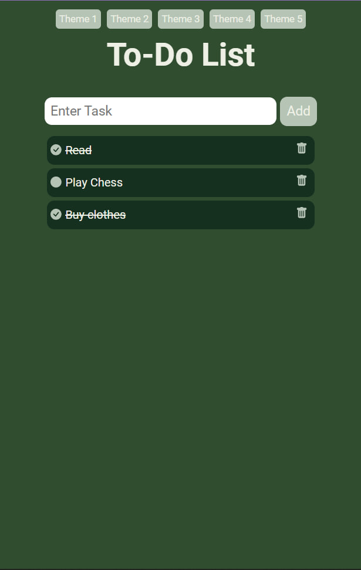
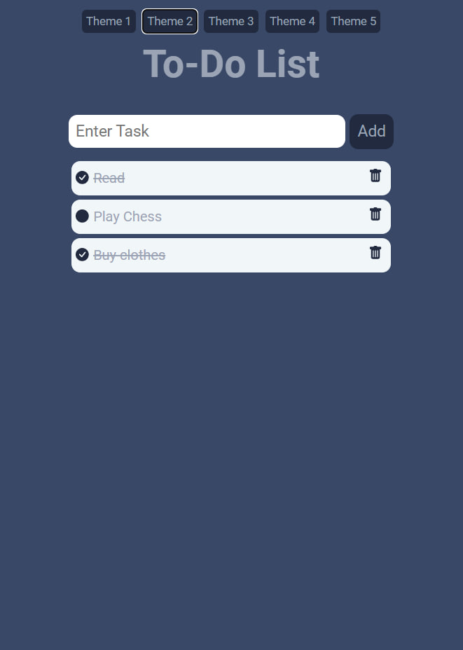
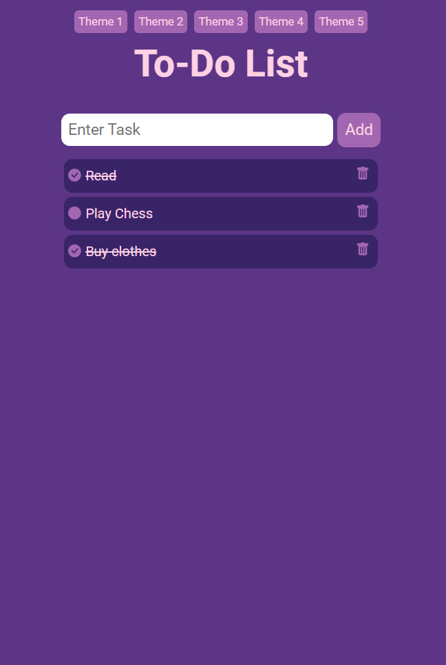
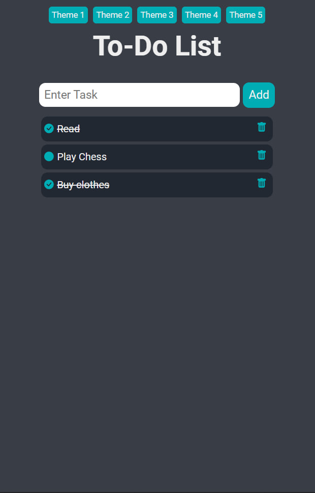
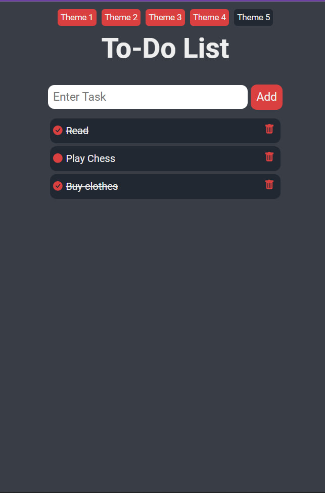

# To-Do List Web Application

A simple To-Do List application built using the MERN stack.

## Technologies Used

- MongoDB
- Express JS
- React JS
- Node.js
- Nodemon
- CORS
- Axios
- SCSS
- HTML
- CSS
- Mongoose

## Features

- Add tasks to the to-do list.
- Mark tasks as "done" with a checkbox.
- Delete tasks.
- Choose between 5 different color themes.
- Mobile-Responsive

## Local Setup

Follow these steps to run the project locally:

1. **Prerequisites:**
   - Ensure you have Node.js and MongoDB installed on your machine.

2. **Clone the repository:**

    ```bash
    git clone https://github.com/your-username/your-repo.git
    ```

3. **Navigate to the `frontend` directory:**

    ```bash
    cd your-repo/frontend
    ```

4. **Run the frontend:**

    ```bash
    npm run dev
    ```

5. **Navigate back to the root directory:**

    ```bash
    cd ..
    ```

6. **Navigate to the `backend` directory:**

    ```bash
    cd backend
    ```

7. **Run the backend:**

    ```bash
    npm start
    ```

8. **Open your browser and go to the specified port (visible in the terminal after starting the frontend).**

## Screenshots





